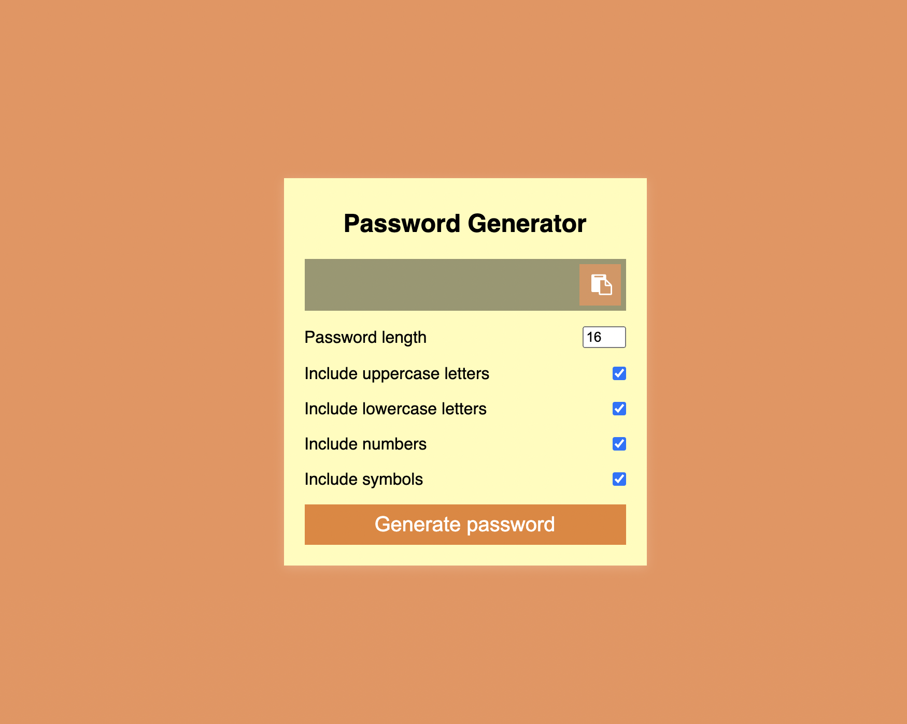

This is a functional Password Generator that I made coding along with the amazing Brad Traversy of Traversy Media. The video is [here](https://www.youtube.com/watch?v=duNmhKgtcsI&ab_channel=TraversyMedia) 

In this application, I was able to go through a ton of different JS functions and higher order functions, such as: 

- used the charset map to find out how buttons correspond with different characters mapped on to a keyboard. Useful link [here](https://net-comber.com/charset.html)
- addEventListener('click', () => {
- used typesCount to check automatically if certain types in my settings were used and if not, would return an empty string
- arrow functions => {}
- used an external randomColor() code in order to generate 'attractive' colours, however they still look a bit garish and I need to adjust the hues in the next iteration.  - installed from [here](https://randomcolor.lllllllllllllllll.com/)

Please try out the program [here!](https://zenidith.github.io/passwordgenerator/)

Happy coding!